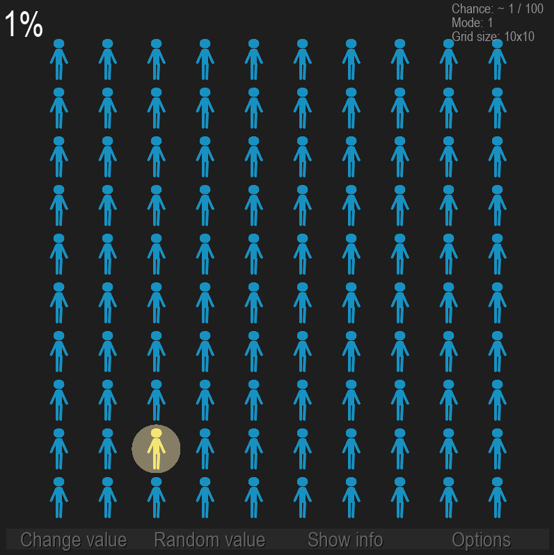
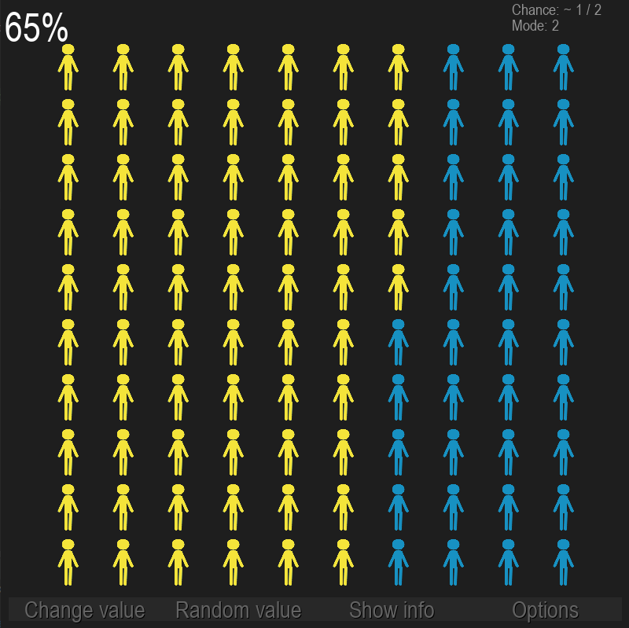
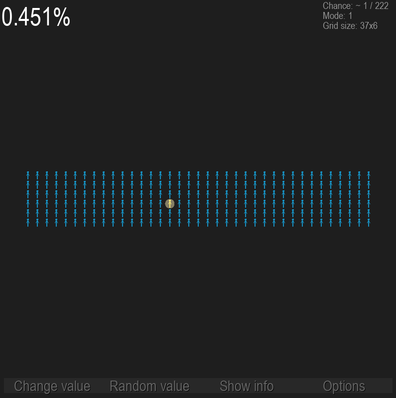

# Percent Visualiser
***
You've ever wanted to see just how miserable one person looks like in a crowd? This program is definitely for you!
***
How to run it:
```
git clone https://github.com/crawlic-stud/PercentVisualiser.git
```
```
pip install pygame
```
```
python main.py
```
***
### Some screenshots:



***
### Contacts:
* [Telegram](https://t.me/crawlic)
* [VK](https://vk.com/ovalmercyy)